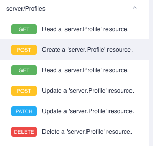
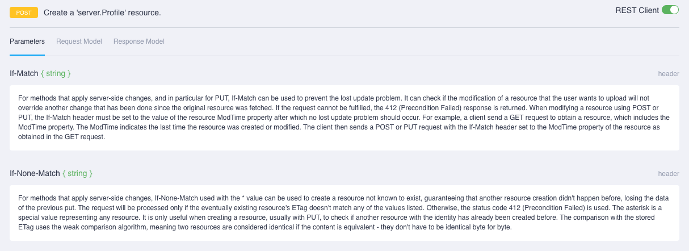
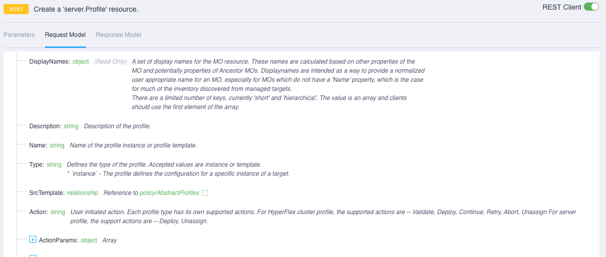
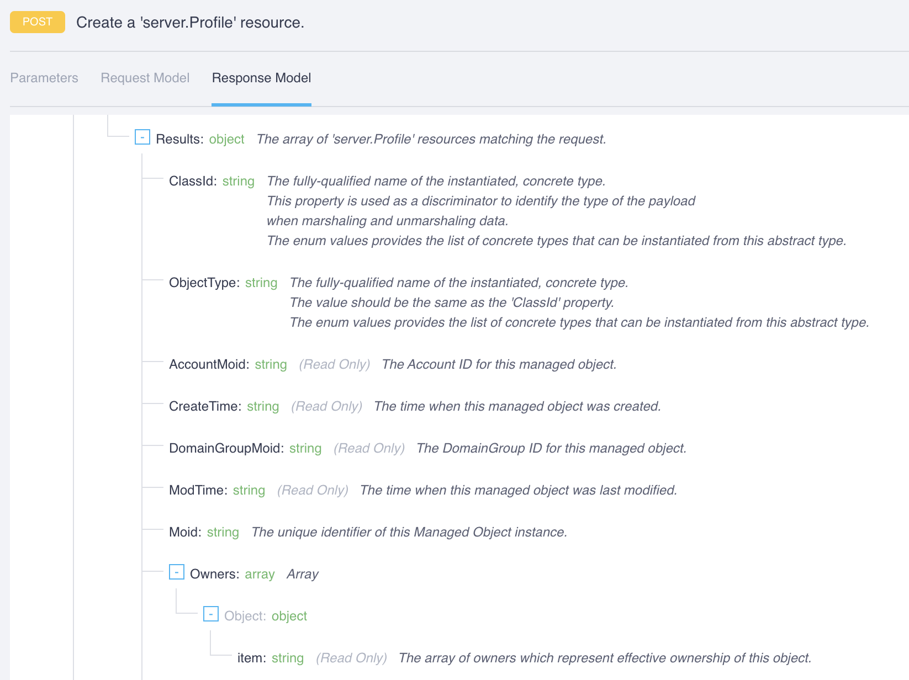
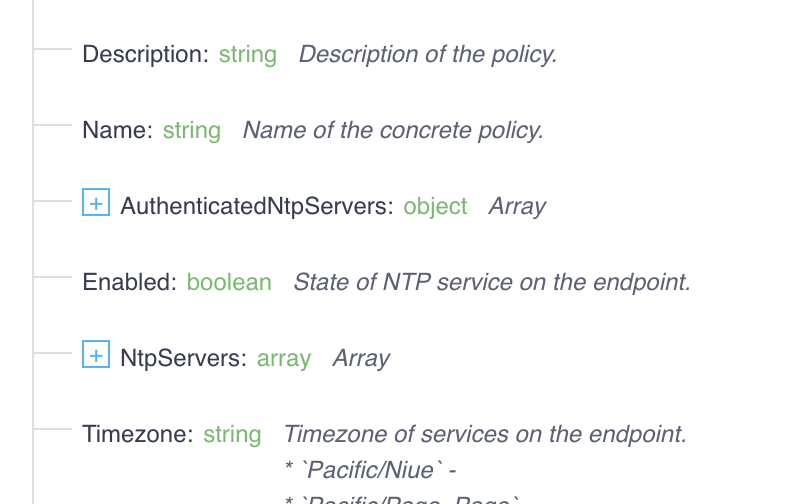
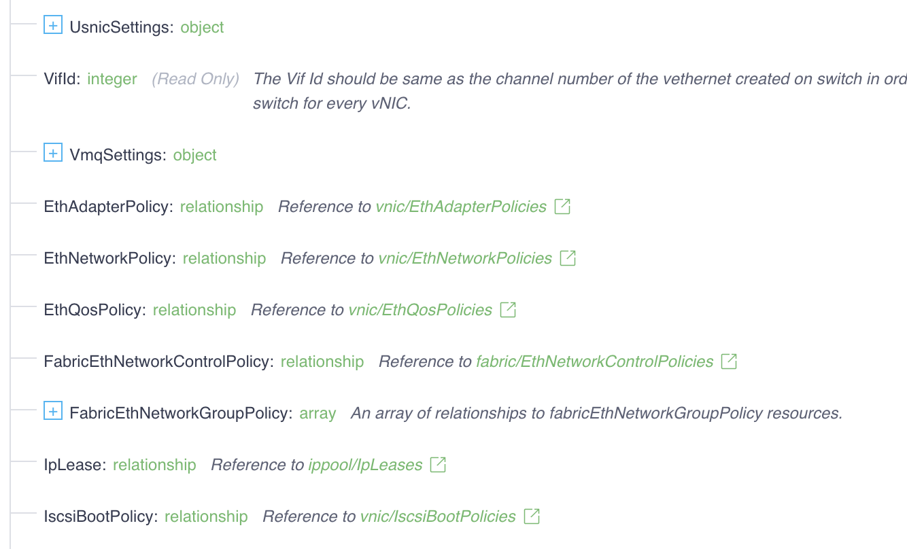

# Intersight REST API

A full overview of Intersight and its APIs is beyond the scope
of this session, especially given the efforts of the Intersight
team to provide a freely available set of [API Documentation](https://intersight.com/apidocs/introduction/overview/).
However, a few highlights of the API are essential to this session.

If, however, you'd like to simply jump to the "Hands On" portion
of this section, simply
[set up your Intersight credentials](./hands-on-exercise.md).

## OpenAPI Based
First, the API is based on the [OpenAPI specification](https://github.com/OAI/OpenAPI-Specification/blob/master/versions/3.0.3.md)
which permits comprehensive definition of the various RESTful API
endpoints. With Intersight, the endpoints generally are the various
models that define service configuration and operations. The spec
includes the various methods (GET, POST, etc.) supported for the
endpoints and the schema for the appropriate request or response
resources required.

As a simple example, let's look at the focus of this session - the
[server/Profiles](https://intersight.com/apidocs/apirefs/api/v1/server/Profiles/post/) endpoint,specifically the "POST" method.

This combination of method and endpoint maps to creating a server.Profile
instance (managed object or MO) within Intersight. The required
information (Request Model) must be sent in the request body:

The returned resource (Response Model) will be sent in the response body.

## Model Based

We've made reference to this aspect a couple of times but the implications
of this property bear discussion. Iteracting with the REST API results in the
creation, update, or deletion of objects based on those models inside the
Intersight service. The Intersight API docs have the details of this
[Management Information Model](https://intersight.com/apidocs/introduction/mit/).

For the purposes of this session, we'll summarize that the models that
users interact with on a regular basis tend to fall into two general
categories: fundamental and relational.

Fundamental models describe primary data that defines a particular resource.
An excellent example of a fundamental model is
[ntp.Policy](https://intersight.com/apidocs/apirefs/ntp/Policies/model/):

The model contains primary information about NTP configuration, such as a
list of NTP servers and the timezone.

Relational models will have some primary data in them but are primarily
(hah! get it?) about defining relationship between fundamental models.
An excellent example of a relational model is
[vnic.EthIfs](https://intersight.com/apidocs/apirefs/vnic/EthIfs/model/):

In the image (a subset of the model), we can see some primary information
related to the specific ethernet interface (usNIC settings, VMQ settings,
etc.). However, a significant number of attributes of the model are
references to other objects (keyword: "relationship"), such as [EthAdapterPolicy](https://intersight.com/apidocs/apirefs/vnic/EthAdapterPolicies/model/),
[EthNetworkPolicy](https://intersight.com/apidocs/apirefs/vnic/EthNetworkPolicies/model/),
and [EthQosPolicy](https://intersight.com/apidocs/apirefs/vnic/EthQosPolicies/model/).

These relationship models are the foundation (hah! I did it again) of the
UCS ecosystem templating and policy re-use capabilities. Many policies and
configuration settings are either company wide, site specific, or
deployment specific. In other ecosystems, we would have to enter that
information in each and every server element. When a change is needed, we'd
have to touch every server element to update it.

In the UCS ecosystem, you define these foundational models/policies once and
simply refer to them in the relational models/policies/profiles.

## Authentication

For interactive logins, Intersight provides several mechanisms for
authentication, from leveraging a **cisco.com** login,
[multifactor authentication](https://intersight.com/help/saas/resources#multi-factor_authentication_in_intersight),
to a [Single Sign On](https://intersight.com/help/saas/resources#single_sign-on_with_intersight)
provider that itself could also leverage MFA.

For REST API access and the levels of security required by our customers, a
two factor mechanism is primarily leveraged to securely authenticate
requests to the REST API. The two components are:
- API Key ID (hexadecimal string)
- API Secret Key (PEM encoded text file)

The API Key ID operates like a standard token passed in the HTTP request
header. The API Secret Key is used to sign each and every request sent to
the API. The [digital signature](https://en.wikipedia.org/wiki/Digital_signature)
string that is generated is stored as a header attribute in the request.
Intersight then validates the signature to ensure the author of the measure
(valid signature) and that the contents are unaltered.
