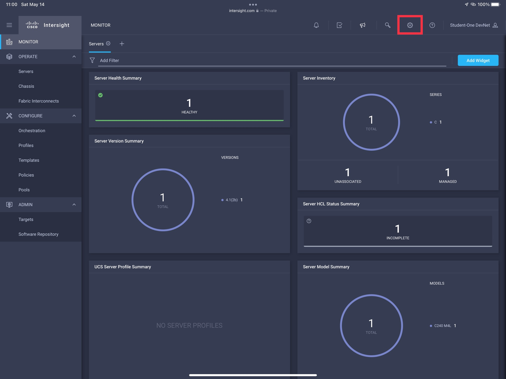
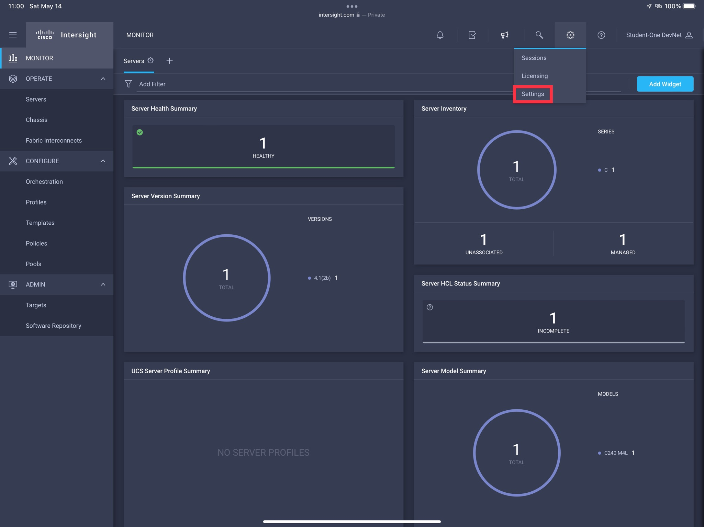
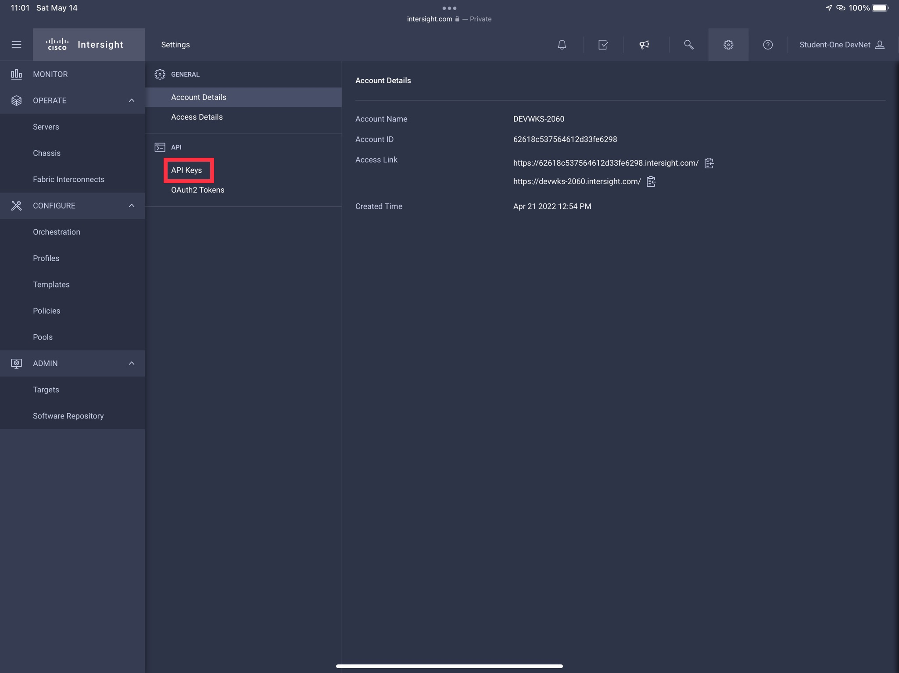
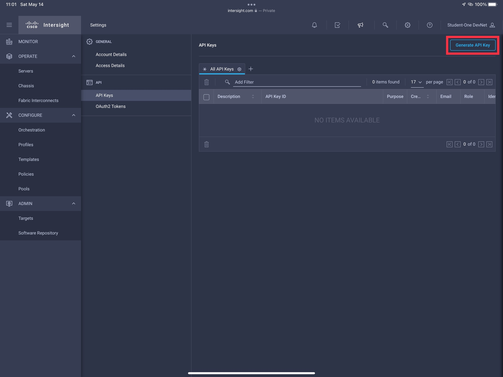
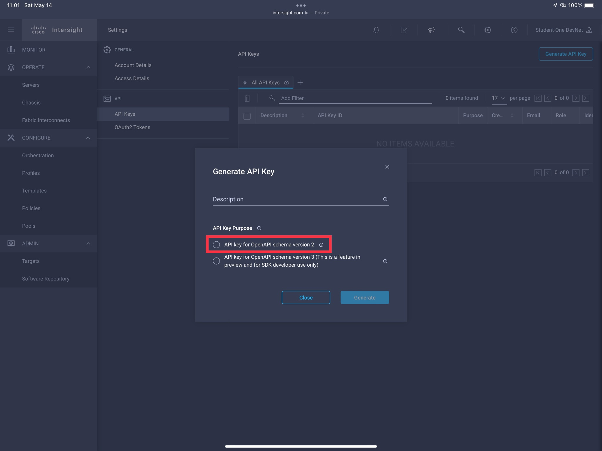
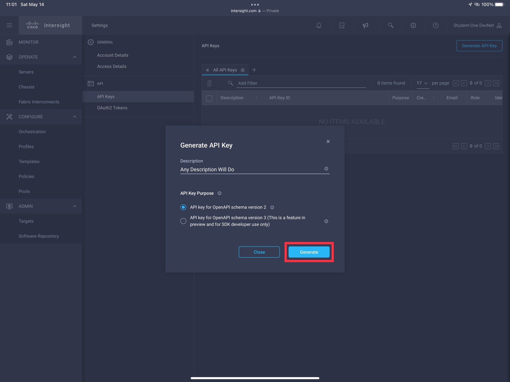
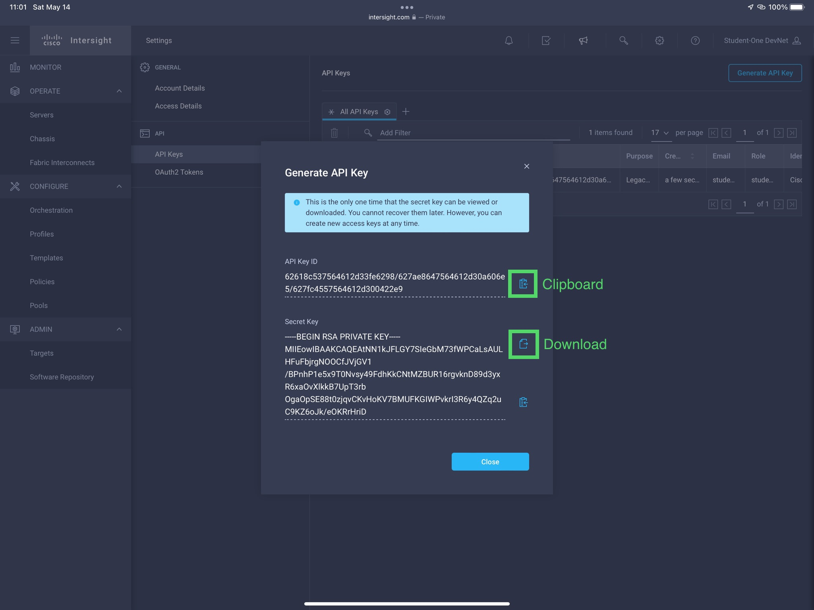

## Hands On Portion

In this section, attendees will be generating their API Key ID and API Secret Key in the Intersight portal. For the in-person event, each attendee will have received a set of credentials with which to log into the Intersight portal.

You'll begin by opening a new browser window or tab, navigate to:

```
https://intersight.com
```

Log into Intersight with provided credentials (or, if participating from home, your Cisco.com or intersight.com credentials). For session attendees, you should be presented by the following dashboard:



To generate the key, you'll need to navigate to the account settings via the indicated gear icon (image above) and menu selection indicated below.



In the settings pane, select the API Keys Menu (image below)



and press the Generate API Key button in the upper right (image below).



You'll be presented with the options needed for key generation:



For this session, the automation relies on "Schema Version 2". In a production environment, you would provide a meaningful description but that's optional for this workshop. An example is provided below along with the next step in the
process - click "Generate".



**STOP!!!***

**_DO NOT PROCEED ANY FURTHER!!!_**

**DO NOT CLICK ANYTHING**



The above screen is the most important part of the process. If you close it without saving the information, you'll have to start over again.

You will save the API Key Id by copying it to the clipboard and then saving it to a file in the terminal.

```bash
cat > DEVWKS-2060-Default-KeyID.txt
```

Paste the API Key ID value in the terminal (Ctrl-V) and then leave the edit session (Ctrl-D).

Next, you will save the API Secret Key. Normally you would download it to the proper location. For this session, we'll copy the contents to the clipboard like we did above and paste them into the correct file.

```bash
cat > DEVWKS-2060-Default-Secret.txt
```

Paste the API Secret Key File contents in the terminal (Ctrl-V) and then leave the edit session (Ctrl-D).

Those actions store the credentials for the duration of this session. However, the Terraform we will be running requires those contents to be stored in environment variables, which we'll set as follows:

```bash
export TF_VAR_apikey=$(cat DEVWKS-2060-Default-KeyID.txt)
export TF_VAR_secretkey="${PWD}/DEVWKS-2060-Default-Secret.txt"
```

In production environments, please choose to conform to better security practices than this.

Finally, we are going to test the credentials to ensure everything is set up correctly.

```bash
cd terraform
terraform init
terraform plan
terraform apply --auto-approve
```

For successfully authentication set up, you'll see the following output for each command.

### terraform init

```
Initializing the backend...

Initializing provider plugins...
- Reusing previous version of ciscodevnet/intersight from the dependency lock file
- Using previously-installed ciscodevnet/intersight v1.0.28

Terraform has been successfully initialized!

You may now begin working with Terraform. Try running "terraform plan" to see
any changes that are required for your infrastructure. All Terraform commands
should now work.

If you ever set or change modules or backend configuration for Terraform,
rerun this command to reinitialize your working directory. If you forget, other
commands will detect it and remind you to do so if necessary.
```

### terraform plan

```
No changes. Your infrastructure matches the configuration.

Terraform has compared your real infrastructure against your configuration and found no differences, so no changes
are needed.
```

### terraform apply --auto-approve

```
No changes. Your infrastructure matches the configuration.

Terraform has compared your real infrastructure against your configuration and found no differences, so no changes
are needed.

Apply complete! Resources: 0 added, 0 changed, 0 destroyed.
```

Aside from not seeing any errors (or Terraform actually creating any new state), you can validate you received existing state for the default organization by listing the state data stored in the local Terraform state file.

```bash
$ terraform state list
```

The output should be:

```
data.intersight_organization_organization.default
```

Congratulations, you are now all set to begin automating the deployment of your Intersight environment.
